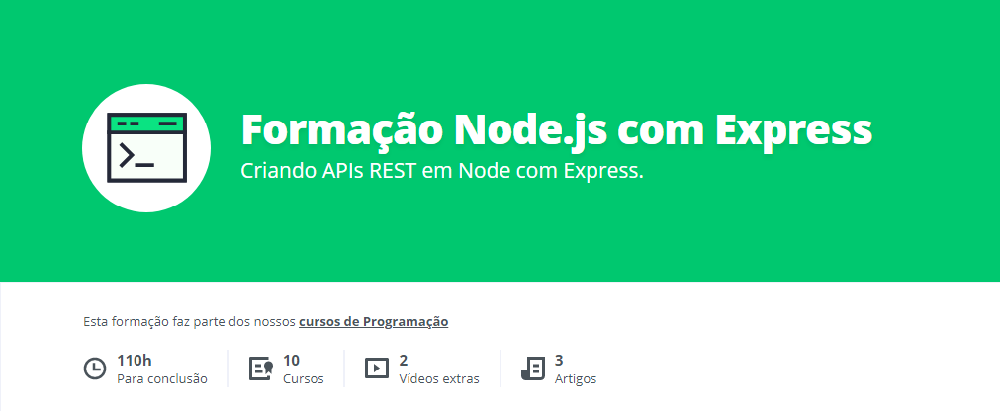

# Formação NodeJS - Alura

## Cursos
- [x] Rest com NodeJS: API com Express e MySQL
- [x] NodeJS: Streaming de dados e Repositório
- [ ] NodeJS: Crie uma API REST padronizada e escalável
- [ ] NodeJS: Avançando em APIs REST com controle de versões
- [ ] ORM com NodeJS: API com Sequelize e MySQL
- [ ] ORM com NodeJS: Avançando nas funcionalidades do Sequelize
- [ ] Node.js e JWT: autenticação com tokens
- [ ] Node.js: Refresh Tokens e confirmação de cadastro
- [ ] NodeJS: Controle de acesso e autorização com RBAC
